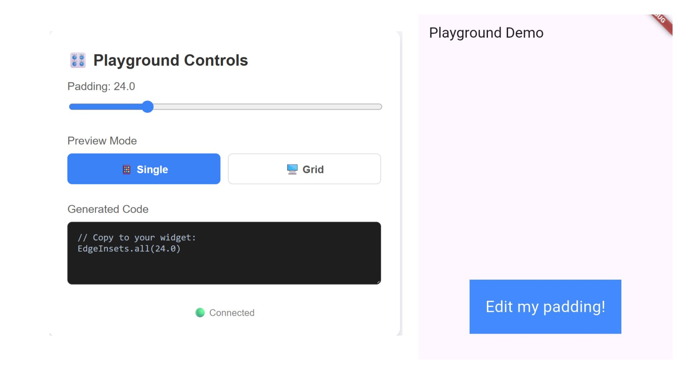
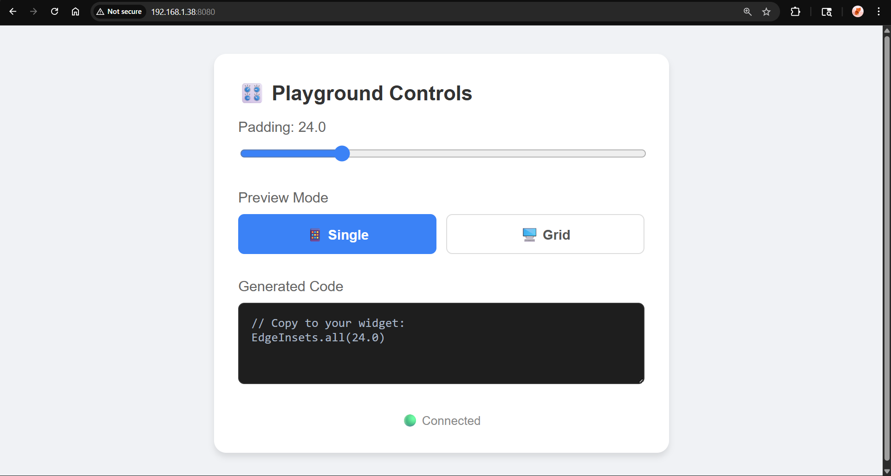
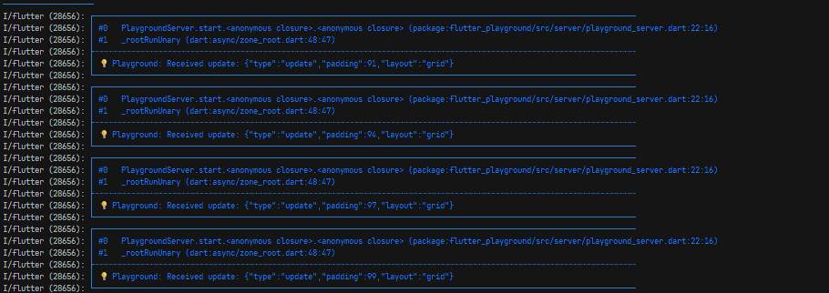
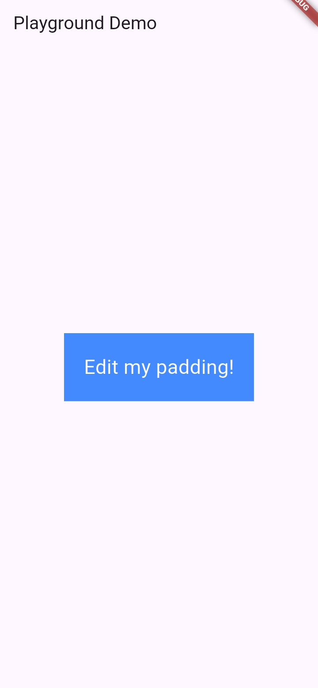
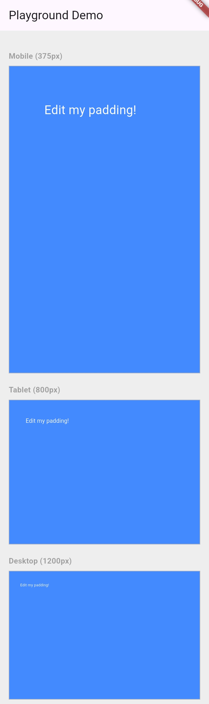

# Flutter Playground

> **Stop rebuilding. Start tweaking.**

A real-time component playground for Flutter. Tweak properties on a web dashboard and see changes instantly on your device — without recompiling or hot reloading.



---

## Why?

Flutter's hot reload is fast, but tweaking UI values (padding, colors, alignment) still requires:
1. Changing code
2. Saving
3. Waiting for the frame to update
4. Repeating x100

**Flutter Playground** solves this by running a local web server inside your app. You open the dashboard in your browser, move a slider, and the widget on your device updates instantly over WebSocket — no recompile, no reload.

---

## Features

- **Live Property Editing:** Tweak padding, colors, and text in real-time from your browser.
- **Responsive Grid View:** See Mobile (375px), Tablet (800px), and Desktop (1200px) layouts side-by-side on your device.
- **Zero-Setup:** No external tools. The dashboard is served directly from the app.
- **Code Export:** The dashboard generates the Dart code snippet as you tweak — copy it when you're happy.

---

## How It Works

```
Your Device (Flutter App)
        |
   Shelf HTTP Server (port 8080)
        |
   WebSocket (/ws)
        |
   Browser Dashboard (your laptop)
```

When you move a slider on the dashboard, it sends a JSON message over WebSocket to the Flutter app. The `Playground` widget receives it, calls `setState`, and rebuilds with the new values — all in under a frame.

---

## Installation

**Step 1 — Add the dependency to your `pubspec.yaml`:**

```yaml
dependencies:
  flutter_playground:
    git:
      url: https://github.com/rajparihar281/flutter_playground.git
      ref: v0.1.0
```

**Step 2 — Add the Internet permission for Android.**

In `android/app/src/main/AndroidManifest.xml`, add this line above the `<application>` tag:

```xml
<uses-permission android:name="android.permission.INTERNET"/>
```

**Step 3 — Run `flutter pub get`.**

---

## Usage

**Step 1 — Wrap your widget with `Playground`:**

```dart
import 'package:flutter/material.dart';
import 'package:flutter_playground/flutter_playground.dart';

class MyWidget extends StatelessWidget {
  @override
  Widget build(BuildContext context) {
    return Playground(
      builder: (context, values) {
        final double padding = (values['padding'] as num?)?.toDouble() ?? 10.0;

        return Container(
          color: Colors.blueAccent,
          padding: EdgeInsets.all(padding),
          child: const Text(
            'Edit my padding!',
            style: TextStyle(color: Colors.white, fontSize: 24),
          ),
        );
      },
    );
  }
}
```

The `builder` gives you a `values` map. Every key in that map corresponds to a control on the dashboard. Always provide a default (`?? 10.0`) for when the app first starts and no value has been sent yet.

**Step 2 — Run the app on a physical Android device or emulator:**

```bash
flutter run
```

**Step 3 — Find the dashboard URL in your console:**

```
-------------------------------------------------------
Playground Server running on http://0.0.0.0:8080
Access from laptop via: http://<PHONE_IP_ADDRESS>:8080
-------------------------------------------------------
```

The `0.0.0.0` means the server is listening on all network interfaces. You need your device's actual local IP address to open the dashboard from your laptop.

**Step 4 — Find your device's IP address:**

- Android: Settings → About Phone → Status → IP Address
- Or run this in your terminal: `adb shell ip route`

Your device and laptop must be on the **same Wi-Fi network**.

**Step 5 — Open the dashboard in your browser:**

```
http://<YOUR_DEVICE_IP>:8080
```

Example: `http://192.168.1.5:8080`

You will see the Playground Controls dashboard. The status at the bottom will show **Connected** once the WebSocket link is established.

**Step 6 — Tweak properties and watch your device update live:**

- Drag the **Padding** slider — the widget on your device updates in real-time.
- Click **Grid** — your device switches to the responsive viewer showing Mobile, Tablet, and Desktop sizes stacked.
- Click **Single** to go back to the normal single view.
- The **Generated Code** box updates as you tweak. Copy it when you're done.


<br/>


---

## Running the Example App

The `example/` folder contains a ready-to-run demo app.

```bash
git clone https://github.com/rajparihar281/flutter_playground.git
cd flutter_playground/example
flutter pub get
flutter run
```

Then follow Steps 3–6 above.




---

## Requirements

- Flutter 3.10.0 or higher
- Dart 3.0.0 or higher
- Android device or emulator (iOS works too, but the INTERNET permission step is Android-specific)
- Device and laptop on the same local network (for physical device usage)

---

## Tech Stack

- **Shelf:** Lightweight Dart HTTP server running inside the Flutter app.
- **shelf_web_socket:** WebSocket handler for real-time bi-directional communication.
- **web_socket_channel:** WebSocket client/server abstraction.
- **logger:** Structured console logging for server events.
- **HTML/JS:** Zero-dependency dashboard served as an inline string directly from Dart.

---

## License

MIT
